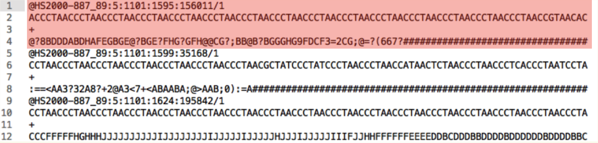

```{r setup_ggplot2, include=FALSE}
knitr::opts_chunk$set(echo = TRUE)
require(rtracklayer)
require(Rsubread)
require(profileplyr)
require(magrittr)
require(TxDb.Hsapiens.UCSC.hg19.knownGene)
require(rtracklayer)
require(rio)
require(ggplot2)
require(Rsamtools)
AsSlides <- TRUE
TESTORNOT <- FALSE
```

## Overview

- Set up
- Genomic Heatmaps
- Making a simple heatmap
- More complex heatmaps

---
class: inverse, center, middle

# Set up

<html><div style='float:left'></div><hr color='#EB811B' size=1px width=720px></html> 

---
## Materials

All prerequisites, links to material and slides for this course can be found on github.

* [GenomicHeatmapsAndProfiles](https://rockefelleruniversity.github.io/GenomicHeatmapsAndProfiles/)

Or can be downloaded as a zip archive from here.

* [Download zip](https://github.com/rockefelleruniversity/GenomicHeatmapsAndProfiles/zipball/master)

---
## Presentations, source code and practicals

Once the zip file in unarchived. All presentations as HTML slides and pages, their R code and HTML practical sheets will be available in the directories underneath.

* **presentations/slides/**
Presentations as an HTML slide show.
* **presentations/singlepage/** 
Presentations as an HTML single page.
* **presentations/r_code/**
R code in presentations.


---
## Set the Working directory


Before running any of the code in the practicals or slides we need to set the working directory to the folder we unarchived. 

You may navigate to the unarchived GenomicHeatmapsAndProfiles folder in the Rstudio menu.

**Session -> Set Working Directory -> Choose Directory**

or in the console.

```{r setwd_introtoR,eval=F} 
setwd("/PathToMyDownload/GenomicHeatmapsAndProfiles/r_course")
## For Fuchs Lab
# e.g. setwd("/Workshop_Data/TestFolder/")
```


---
class: inverse, center, middle

# Raw data to visualisations

<html><div style='float:left'></div><hr color='#EB811B' size=1px width=720px></html> 

---
## Genomics data visualisations

A common task in genomics is to review your data in your favourite genome browser.
Here we are using IGV and [our material is available here](https://rockefelleruniversity.github.io/IGV_course/)

<div align="center">

</div>

---
## Genomics data visualisations

To visualise our data we first need to get our data in a suitable format for visualisation. For more information on file formats see [our material is available here](https://rockefelleruniversity.github.io/Genomic_Data/)

High throughput Sequencing data is typically delivered as unaligned sequences in [FastQ format](https://rockefelleruniversity.github.io/Genomic_Data//r_course/presentations/slides/GenomicsData.html#12).

 **FastQ (FASTA with Qualities)**
<div align="center">

</div>

- "@" followed by identifier.
- Sequence information.
- "+" 
- Quality scores encodes as ASCI.

---
## Genomics data visualisations

We need to work with aligned data for visualisation and analysis in our genome of choice. Aligned sequence data is often stored in [SAM format](https://rockefelleruniversity.github.io/Genomic_Data//r_course/presentations/slides/GenomicsData.html#15).

**SAM - Sequence Alignment Map**

<div align="center">

</div>

- Contains read and alignment information including genomic location

---
## Genomics data visualisations

Typically for visualisation in genome browsers we require only a subset of this information - Depth of reads/Signal at genomic locations. 
We can then take advantage of more reduced formats such as [bedGraph](https://rockefelleruniversity.github.io/Genomic_Data//r_course/presentations/slides/GenomicsData.html#27) (an extension of [BED](https://rockefelleruniversity.github.io/Genomic_Data//r_course/presentations/slides/GenomicsData.html#27)).

**bed(Browser Extensible Data)Graph**

.pull-left[
 <div align="center">

</div>
  ]
.pull-right[
- BED 3 format
    - Chromosome
    - Start 
    - End
    
4th column - Score
  ]


---
## Genomics data visualisations

These format are easy for us to read but inefficent for software to work with. When using software we will most often work with [highly compressed and indexed equivalent files.](https://rockefelleruniversity.github.io/Genomic_Data//r_course/presentations/slides/GenomicsData.html#39)

* SAM -- BAM (with a .bai index)
* wig/bedGraph -- bigWig

---
class: inverse, center, middle

# Raw data to visualisations in R (Quick)

<html><div style='float:left'></div><hr color='#EB811B' size=1px width=720px></html> 

---
## Full workflows available.

In the next few slides we are going to run through an alignment of ChIP-seq FastQ to sorted and indexed BAM files and then create a bigWig.

For a full summary of this processing please see our relevant courses

* [RNA-seq](https://rockefelleruniversity.github.io/RU_RNAseq/)
* [ChIP-seq](https://rockefelleruniversity.github.io/RU_ChIPseq/)
* [ATAC-seq](https://rockefelleruniversity.github.io/RU_ATACseq/)

---
## A reference genome.

To align our raw fastQ data we will need a reference genome in [FASTA format](https://rockefelleruniversity.github.io/Genomic_Data//r_course/presentations/slides/GenomicsData.html#9) to align against. 

We can retrieve this from [Ensembl FTP](https://www.ensembl.org/info/data/ftp/index.html) download page for many organisms.

<div align="center">

</div>

---
## A reference genome in R.

We can also extract genomes from Bioconductor objects inside of R. Here we use the **BSgenome.Hsapiens.UCSC.hg19** to [extract the sequence for major chromosomes and write out to a FASTA file](https://rockefelleruniversity.github.io/Bioconductor_Introduction/r_course/presentations/slides/SequencesInBioconductor.html#4).

```{r GetFasta,cache=TRUE,warning=FALSE,message=FALSE,eval=FALSE}
require(BSgenome.Hsapiens.UCSC.hg19)
mainChromosomes <- paste0("chr",c(1:22,"X","Y","M"))
mainChrSeq <- lapply(mainChromosomes,
                     function(x)BSgenome.Hsapiens.UCSC.hg19[[x]])
names(mainChrSeq) <- mainChromosomes
mainChrSeqSet <- DNAStringSet(mainChrSeq)
writeXStringSet(mainChrSeqSet,
                "BSgenome.Hsapiens.UCSC.hg19_majorChr.fa")
```

---
## FastQ to BAM and bigWigs.

Once we have the FASTA file available we can [prepare the index of FASTA for alignment using the Rsubread package](https://rockefelleruniversity.github.io/Bioconductor_Introduction/r_course/presentations/slides/AlignmentInBioconductor.html#39).
The **indexSplit** paramter here will save us memory in alignment but may cost us some speed.

```{r index,cache=TRUE,warning=FALSE,message=FALSE,eval=FALSE}
require(Rsubread)
buildindex("BSgenome.Hsapiens.UCSC.hg19",
           "BSgenome.Hsapiens.UCSC.hg19_majorChr.fa",
           indexSplit = TRUE)
```

---
## FastQ to BAM and bigWigs.

Once we have our index we can [align our FastQ to the genome using the **align** function](https://rockefelleruniversity.github.io/Bioconductor_Introduction/r_course/presentations/slides/AlignmentInBioconductor.html#40) to create a BAM file.

```{r align,cache=TRUE,warning=FALSE,message=FALSE,eval=FALSE}
align("BSgenome.Hsapiens.UCSC.hg19",
      "ENCFF001NQP.fastq.gz",
      output_file="ENCFF001NQP.bam",
      type="dna")
```
---
## FastQ to BAM and bigWigs.

We can then [sort and index this BAM file to be ready for use in external software by using the R interfact to samtools (Rsamtools)](https://rockefelleruniversity.github.io/Bioconductor_Introduction/r_course/presentations/slides/AlignmentInBioconductor.html#19)

```{r countw,cache=TRUE,warning=FALSE,message=FALSE,eval=FALSE}
require(Rsamtools)
sortBam("ENCFF001NQP.bam","Sorted_ENCFF001NQP")
indexBam("Sorted_ENCFF001NQP.bam")
```

---
## FastQ to BAM and bigWigs.

Now we have a indexed BAM file we can easily extract the total mapped reads.

```{r countw2a,cache=TRUE,warning=FALSE,message=FALSE,eval=FALSE,echo=TRUE}
MappedReads <- idxstatsBam("Sorted_ENCFF001NQP.bam")
TotalMappedReads <- sum(MappedReads$mapped)
```

```{r countw2,cache=TRUE,warning=FALSE,message=FALSE,eval=TRUE,echo=FALSE}

MappedReads <- idxstatsBam("~/Desktop/Projects/brc/renvTest/AnotherTest2/BAMs/Sorted_shPTBP153_1.bam")
TotalMappedReads <- 10302212
TotalMappedReads
```

---
## Make a bigWig.

We can then make our bigWig in a few lines of R [using the **rtracklayer** package.](https://rockefelleruniversity.github.io/Bioconductor_Introduction/r_course/presentations/slides/Summarising_Scores_In_Bioconductor.html#24)

```{r bw,cache=TRUE,warning=FALSE,message=FALSE,eval=FALSE}
require(rtracklayer)
coverageOverGenome <- coverage("Sorted_ENCFF001NQP.bam",
                               weight = (10^6)/TotalMappedReads)
export.bw(coverageOverGenome,con="Sorted_ENCFF001NQP.bw")
```

---
class: inverse, center, middle

# Visualising signal over multiple genomic regions

<html><div style='float:left'></div><hr color='#EB811B' size=1px width=720px></html> 

---
## Review in IGV

We can easily review our signal data in IGV at a simgle locus to assess the relationship between samples/conditions/antibodies.

<div align="center">

</div>

---
## Multipanel review in IGV

In IGV we can also review multiple loci in one screen to get an overview of signal over a group of regions.

<div align="center">

</div>


---
## Visualisation in heatmaps

Often we want to review signal within and between samples/conditions over 1000s of sites. To do this we can take advantage of genomic heatmaps and profiles.

.pull-left[
Two major softwares to produce genomic heatmaps
* Deeptools
* EnrichedHeatmap
  ]
.pull-right[
 <div align="center">

</div>
 <div align="center">

</div>
  ]


---
## ProfilePlyr package

Many requests for complex heatmaps and summary statistics of data visualised within.

.pull-left[
Profileplyr is available from Bioconductor and developed with Doug Barrows to 
- Allow import/export between Deeptools and R framework
- Provide easy tools to manipulate and summarise heatmap data.
  ]
.pull-right[
 <div align="center">

</div>
]

---
## Getting hold of DeepTools

You will not require Deeptools to follow the course but if you would like to install this can be done easily through [Conda](https://anaconda.org/bioconda/deeptools) or [Docker](https://deeptools.readthedocs.io/en/develop/content/installation.html#installation-with-docker).

For more information on [Deeptools you can see our course here.](https://rockefelleruniversity.github.io/RU_VisualizingGenomicsData/viz_course/Presentations/Slides/deeptools_lecture_20190208.html#1)
<div align="center">

</div>

---
## Getting hold of data.

First we need to get hold of some data to plot. 

For demonstration we will take a small processed data set of bigWigs from a paper containing ChIP-seq for the transcription factos ZBTB1 and ATf4.

We can retrieve raw and processed data for GSM4332935, GSM4332934, GSM4332940, GSM4332950 and GSM4332944 directly from [GEO](https://www.ncbi.nlm.nih.gov/geo/query/acc.cgi?acc=GSE145783).

<div align="center">

</div>

---
## Getting hold of data.

We can also use some of the tools in Bioconductor to retrieve supplementary files from GEO directly.

To do this we will use the GEOquery package. We can install this following the commands on the Bioconductor page for [GEOquery](https://www.bioconductor.org/packages/release/bioc/html/GEOquery.html).

```{r, gettingData,eval=FALSE}
if (!requireNamespace("BiocManager", quietly = TRUE))
    install.packages("BiocManager")

BiocManager::install("GEOquery")

```


---
## Getting hold of data.

We can use the **getGEOSuppFiles** function to download any supplementary files to our local working directory.

```{r download_Data1,cache=TRUE,warning=FALSE,message=FALSE,echo=TRUE,eval=FALSE}
require(GEOquery)

GSM4332935_BigWig <- getGEOSuppFiles("GSM4332935",fetch_files = TRUE,
                                     makeDirectory = FALSE,
                                     filter_regex = "*.bw")
GSM4332934_BigWig <- getGEOSuppFiles("GSM4332934",fetch_files = TRUE,
                                     makeDirectory = FALSE,
                                     filter_regex = "*.bw")
GSM4332944_BigWig <- getGEOSuppFiles("GSM4332944",fetch_files = TRUE,
                                     makeDirectory = FALSE,
                                     filter_regex = "*.bw")
GSM4332940_BigWig <- getGEOSuppFiles("GSM4332940",fetch_files = TRUE,
                                     makeDirectory = FALSE,
                                     filter_regex = "*.bw")
GSM4332950_BigWig <- getGEOSuppFiles("GSM4332950",fetch_files = TRUE,
                                     makeDirectory = FALSE,
                                     filter_regex = "*.bw")
```

```{r download_Data2,cache=TRUE,warning=FALSE,message=FALSE,echo=FALSE,eval=FALSE}
require(GEOquery)

GSM4332935_BigWig <- getGEOSuppFiles("GSM4332935",fetch_files = FALSE,
                                     makeDirectory = FALSE,
                                     filter_regex = "*.bw")
GSM4332934_BigWig <- getGEOSuppFiles("GSM4332934",fetch_files = FALSE,
                                     makeDirectory = FALSE,
                                     filter_regex = "*.bw")
GSM4332944_BigWig <- getGEOSuppFiles("GSM4332944",fetch_files = FALSE,
                                     makeDirectory = FALSE,
                                     filter_regex = "*.bw")
GSM4332940_BigWig <- getGEOSuppFiles("GSM4332940",fetch_files = TRUE,
                                     makeDirectory = FALSE,
                                     filter_regex = "*.bw")
GSM4332950_BigWig <- getGEOSuppFiles("GSM4332950",fetch_files = TRUE,
                                     makeDirectory = FALSE,
                                     filter_regex = "*.bw")
```

---
## Regions of interest


We want to plot our signal over selected sets of regions. We will import our regions from a BED file using the import.bed function in **rtracklayer** package
```{r ,echo=TRUE,eval=TRUE,warning=FALSE,message=FALSE}
require(rtracklayer)
ZBTB1_GR <- import.bed("Beds/ZBTB1Peaks.bed")
ZBTB1_GR
```


---
## GRanges

The BED file regions are stored in R as a **GRanges** object. 

**GRanges** objects provide much of the functionality seen in **BedTools**.

```{r ,echo=TRUE,eval=TRUE,warning=FALSE,message=FALSE}
ZBTB1_GR
```

---
## Overlaps in GRanges

One of the most useful function for GRanges objects is the ability to intersect/overlap differing regions.

To demonstate first we will read in a BED file of promoter positions for hg19.

```{r,echo=FALSE,eval=TRUE}
promoterPos <- TxDb.Hsapiens.UCSC.hg19.knownGene %>% genes %>% promoters
rtracklayer::export(promoterPos,con="Beds/Promoter_Positions.bed")
```

```{r ,echo=TRUE,eval=TRUE,warning=FALSE,message=FALSE}
require(rtracklayer)
promoter_positions <- import.bed("Beds/Promoter_Positions.bed")
promoter_positions
```

---
## Overlaps in GRanges

The function **%over%** allows us to evaluate which regions overlap/intersect between two region sets.

* A[A %over% B] -- Returns all regions in A which overlap regions in B
* B[B %over% A] -- Returns all regions in B which  overlap regions in A
* A[!A %over% B] -- Returns all regions in A which do not overlap regions in B

---
## Overlaps in GRanges

So in practice we can easily extract our ZBTB1 peaks which do or do not overlap with promoters.
We can then use the **export.bed** function to write the overlapping GRanges to a BED file

```{r ,echo=TRUE,eval=TRUE,warning=FALSE,message=FALSE}
ZBTB1_In_Promoters <- ZBTB1_GR[ZBTB1_GR %over% promoter_positions]
ZBTB1_Outside_Promoters <- ZBTB1_GR[!ZBTB1_GR %over% promoter_positions]
export.bed(ZBTB1_In_Promoters,
           con="Beds/ZBTB1_In_Promoters.bed")

```


---
## Heatmaps in Deeptools
The DeepTools software provides a set of tools to convert between file types (i.e. BAM to bigWig) and to plot signal from BAM or bigWig over a set of regions as a heatmap. 

[Deeptools course for more information](https://rockefelleruniversity.github.io/RU_VisualizingGenomicsData/viz_course/Presentations/Slides/deeptools_lecture_20190208.html#2)

<div align="center">

</div>


---
## Heatmaps in Deeptools

Two main workhorse functions allow you create these heatmaps in deeptools 

* computeMatrix - Create an intermediate file of signal for heatmap.
* plotHeatmap - Generate the heatmaps from intermediate file.

---
## Creating GenomicHeatmaps

```{bash, eval=FALSE}
computeMatrix reference-point --referencePoint center 
-bs binSize -a BP_after_BED -b BP_before_BED 
-S  BIGWIGSofINTEREST 
--regionsFileName BEDFILEOFINTEREST 
--outFileName OUTFILE

```

The computeMatrix function take a set of arguments to generate an intermediate file

* reference-point --referencePoint  = Specify position in regions in BED file to centre heatmap.
* -bs  = Binsize across regions in BED file
* -b and -a = bp before and after reference point to plot in heatmap.
* -S = BigWigs to plot signal from
* --regionsFileName = BED file containing regions to plot over.
* --outFileName = Name of intermediate file generated.

---
## Creating GenomicHeatmaps

Using our data, the command looks like this.
```{bash, eval=FALSE}
computeMatrix reference-point --referencePoint center 
-bs 50 -a 2000 -b 2000 -p 4 
-S  GSM4332935_Sorted_GFP_MinusN_FLAGNormalised.bw GSM4332940_Sorted_GFP_PlusN_FLAGNormalised.bw GSM4332945_Sorted_ZBTB_MinusN_FLAGNormalised.bw GSM4332950_Sorted_ZBTB_PlusN_FLAGNormalised.bw 
--regionsFileName ZBTB1Peaks.bed 
--outFileName Deeptools_ZBTB1Peaks.MAT 
```

---
## Creating GenomicHeatmaps

Once we have our intermediate file we can use this to create our heatmap using the **plotHeatmap** command.
```{bash, eval=FALSE}
plotHeatmap -m MATRIXFILE 
-o HEATMAP
--colorList lowColour,highColour 
```

* -m  = Name of intermediate file generated by Deeptools computeMatrix.
* -o  = Output file name for heatmap
* --colorList = Bottom and top of colour scale for heatmap.

---
## Creating GenomicHeatmaps

We our data, the plotHeatmap command would be.
```{bash, eval=FALSE}
plotHeatmap -m Deeptools_ZBTB1Peaks.MAT 
-o Deeptools_ZBTB1Peaks.MAT.png 
--colorList white,darkred 
```
<div align="center">

</div>

```{bash, eval=FALSE,echo=FALSE}
computeMatrix reference-point --referencePoint center -bs 50 -a 2000 -b 2000 -p 4 -S  /Users/thomascarroll/Desktop/software/Github/Genomic_HeatmapsAndProfiles//ppBw//GSM4332935_Sorted_GFP_MinusN_FLAGNormalised.bw /Users/thomascarroll/Desktop/software/Github/Genomic_HeatmapsAndProfiles//ppBw//GSM4332940_Sorted_GFP_PlusN_FLAGNormalised.bw /Users/thomascarroll/Desktop/software/Github/Genomic_HeatmapsAndProfiles//ppBw//GSM4332945_Sorted_ZBTB_MinusN_FLAGNormalised.bw /Users/thomascarroll/Desktop/software/Github/Genomic_HeatmapsAndProfiles//ppBw//GSM4332950_Sorted_ZBTB_PlusN_FLAGNormalised.bw --regionsFileName //Users/thomascarroll/Desktop/software/Github/Genomic_HeatmapsAndProfiles/ZBTB1Peaks.bed --outFileName /Users/thomascarroll/Desktop/software/Github/Genomic_HeatmapsAndProfiles/Deeptools_ZBTB1Peaks.MAT 
```

---
## Creating GenomicHeatmaps

The profileplyr package offers a similar set of functionality as the Deeptools software within R. 
To compute our intermediate matrix we can use the **BamBigwig_to_chipProfile** function with the same set of inputs as Deeptools.

```{r zbtb1_1,echo=TRUE,eval=TRUE,cache=TRUE,warning=FALSE,message=FALSE}
require(profileplyr)
bigWigs <- dir(full.names=TRUE,pattern = "FLAG")
zbtb1_profile <- BamBigwig_to_chipProfile(bigWigs,
                                   testRanges = "Beds/ZBTB1Peaks.bed",
                                   style = "point",
                                   format = "bigwig",
                                   distanceAround = 2000)

zbtb1_profile <- as_profileplyr(zbtb1_profile)
zbtb1_profile
```

---
## Creating GenomicHeatmaps

We can then use the **generateEnrichedHeatmap** function to create a heatmap as we did in Deeptools.

```{r "zbtb1_1plot",eval=TRUE,cache=TRUE,dependson="zbtb1_1",fig.width = 10,fig.height = 5}
generateEnrichedHeatmap(zbtb1_profile)
```

---
## Import from DeepTools 

However you generate the intermediate file, you can import/export to Deeptools. This allows you take advantage of any functionality in Deeptools and R together.

```{r "zbtb1_1Deeptools",eval=TRUE,cache=TRUE,fig.width = 10,fig.height = 5}
zbtb1_deeptools <- import_deepToolsMat("Deeptools_ZBTB1Peaks.MAT")
generateEnrichedHeatmap(zbtb1_deeptools)
```
---
## Blacklist

ChIP-seq will often show the presence of common artefacts such as ultra-high signal regions or Blacklists. Such regions can confound peak calling, fragment length estimation and QC metrics.

<div align="center">

</div>


---
## Blacklist

We can retrieve Blacklists from the Encode portal for human, rat and mouse. Here I have pre-downloaded the hg19 Blacklist as a file and put in the Beds directory.


```{r}
blacklist <- rtracklayer::import("Beds/ENCFF001TDO.bed.gz")
blacklist
```

---
## Creating GenomicHeatmaps

The **groupBy** by function allows us to add additional information to our Heatmaps. Here we provide the GRanges of our Blacklist BED file and specify to include sites which do not overlap using the **include_nonoverlapping** argument.

```{r grouped,echo=TRUE,eval=TRUE,cache=TRUE,fig.width = 10,fig.height = 5,message=FALSE,warning=FALSE}
zbtb1_profile_Grouped <- groupBy(zbtb1_profile,
                                 group = blacklist,
                                 include_nonoverlapping = TRUE)
generateEnrichedHeatmap(zbtb1_profile_Grouped)
```

---
## Creating GenomicHeatmaps

We can take advantage of the same **%over%** function we saw earlier with GRanges to filter to just ranges in heatmap which do not overlap our blacklist regions.

```{r bled,echo=TRUE,eval=TRUE,cache=TRUE,fig.width = 10,fig.height = 5}
zbtb1_profile_bl <- zbtb1_profile[!zbtb1_profile %over% blacklist]
generateEnrichedHeatmap(zbtb1_profile_bl)
```

---
## Creating GenomicHeatmaps

Now we have created our filtered set we could export it back to Deeptools to plot using it's plotHeatmap function.

```{r ,echo=TRUE,eval=FALSE,dependson="bled"}
export_deepToolsMat(zbtb1_profile_bl,
                    con="zbtb1_Profileplyr.MAT",
                    overwrite = TRUE)
```


---
## Creating GenomicHeatmaps
```{bash ,echo=TRUE,eval=FALSE}

plotHeatmap -m zbtb1_Profileplyr.MAT.gz 
            -o zbtb1_Profileplyr.MAT.png 
            --colorList white,darkred
```

<div align="center">

</div>


---
## Subsetting 

We can subset our heatmap to only review the samples we want using indexing in R.

Our heatmaps have 3 dimension - Ranges/Rows, Bins/Columns, Samples. To subset samples then we can index our profileplyr object as in standard R.

```{r zbtb_Sub,echo=TRUE,eval=TRUE,cache=TRUE,dependson="plotPromoters",fig.width = 10,fig.height = 5}
zbtb1_profile_subset <- zbtb1_profile_bl[,,3:4]
generateEnrichedHeatmap(zbtb1_profile_subset)

```

---
## Joining heatmaps.

We can also combine heatmaps when they are processed over the same BED file. Here we plot the ATF4 bigwig over the ZBTB1 peaks as we did earlier for ZBTB1 bigwigs.

```{r ATF4,echo=TRUE,eval=TRUE,cache=TRUE}
bigWigs <- dir(full.names=TRUE,pattern = "ATF4")
atf4_profile <- BamBigwig_to_chipProfile(bigWigs,
                                   testRanges = "Beds/ZBTB1Peaks.bed",
                                   style = "point",
                                   format = "bigwig",distanceAround = 2000)
atf4_profile <- as_profileplyr(atf4_profile)
atf4_profile_bl <- atf4_profile[!atf4_profile %over% blacklist]
```

---
## Joining samples 

We can then join our ZBTB1 and ATF4 bigwigs using the common R combine function **c()**.
```{r JoinAndPlot,echo=TRUE,eval=TRUE,cache=TRUE,dependson="ATF4",fig.width = 10,fig.height = 5}
ztbtb1Andatf4_profile <- c(zbtb1_profile_subset,atf4_profile_bl)
generateEnrichedHeatmap(ztbtb1Andatf4_profile)
```

---
## Updating sample names

Sample names in these heatmaps are by default based on the name of the input bigwigs. We can update the samplenames using the **rownames()** and **sampleData()** functions with our profileplyr object.

```{r sampleUpdate,echo=TRUE,eval=TRUE,cache=TRUE,dependson="ATF4",fig.width = 10,fig.height = 5}
rownames(sampleData(ztbtb1Andatf4_profile)) <- c("ZBTB1_1","ZBTB1_2","ATF4_1")
generateEnrichedHeatmap(ztbtb1Andatf4_profile)
```
---
## Updating sample names

We can directly change the sample names when plotting the heatmap too by using the **sample_names** argument.

```{r sampleUpdate22,echo=TRUE,eval=TRUE,cache=TRUE,dependson="sampleUpdate",fig.width = 10,fig.height = 5}
generateEnrichedHeatmap(ztbtb1Andatf4_profile,
                        sample_names=c("zbtb_A","zbtb_B","atf4_A"))
```

---
## Updating sample information

We can also use the **sampleData()** function to add any additional information to our samples. Here we add information on Antibody.

We can add any arbitary column name we need using the **sampleData()** function.

```{r sampleUpdate2,echo=TRUE,eval=TRUE,cache=TRUE,dependson="sampleUpdate",fig.width = 10,fig.height = 5}
sampleData(ztbtb1Andatf4_profile)$Antibody <- c("ZBTB1","ZBTB1","ATF4")
sampleData(ztbtb1Andatf4_profile)$Grade <- c("Favourite","Good","Good")
```

---
## Updating sample information

We can use the information on samples then when we plot our heatmap. Here we tell the **generateEnrichedHeatmap()** function to colour our heatmaps by their Antibody information we just added.

```{r sampleUpdatePlot,echo=TRUE,eval=TRUE,cache=TRUE,dependson="sampleUpdate2",fig.width = 10,fig.height = 5}
generateEnrichedHeatmap(ztbtb1Andatf4_profile,
                        color_by_sample_group = "Antibody")
```


---
## Clustering ranges by summarised signal

Often we want to group ranges across samples by the signal within them. The profileplyr package allows the user to summarise signal within a region and cluster rows according to user defined metrics.

Here we summarise each range by taking the sum of signal within ranges specified in the **fun** paramter and create two clusters from the data specifed by the **cutree_rows** paramter.
```{r clusterAndPlot,echo=TRUE,eval=TRUE,cache=TRUE,dependson="sampleUpdate"}
ztbtb1Andatf4_profile <- clusterRanges(ztbtb1Andatf4_profile,
                        fun = rowSums,
                        cutree_rows = 2)
```

---
## Clustering ranges by summarised signal

We can now review the clustering by simply passing the new profileplyr object to the **generateEnrichedHeatmap** function.

We can see that it has created two clusters which appear to contain high or low ATF4 signal.

```{r,clusterAndPlot2,echo=TRUE,eval=TRUE,cache=TRUE,dependson="clusterAndPlot",fig.width = 10,fig.height = 5}
generateEnrichedHeatmap(ztbtb1Andatf4_profile,
                        color_by_sample_group = "Antibody")
```

---
## Adding Groups with names. 

If we have an additional set of regions which we wish to assess the overall ATF4 signal within, we can use the **groupBy** fnction again to add this information. Here we additionally specify group names in the **GRanges_names** argument.

```{r groupAndPlot,echo=TRUE,eval=TRUE,cache=TRUE,dependson=c("sampleUpdate","makeBed2")}
ATF4ANDZBTB1_Peaks <- import.bed("Beds/ATF4ANDZBTB1_Within2000kb.bed")
ztbtb1Andatf4_profile <- groupBy(ztbtb1Andatf4_profile,
                                 group = ATF4ANDZBTB1_Peaks,
                                 GRanges_names = "ProximalPeaks",
                                 include_nonoverlapping = TRUE)
```

---
## Joining samples 

If we wish to now review the relationship between the clustering and the GRanges group we can use the **extra_annotation_columns** argument to specify additional information to add to the Heatmap.

```{r groupAndPlot2,echo=TRUE,eval=TRUE,cache=TRUE,dependson="groupAndPlot",fig.width = 10,fig.height = 5}
generateEnrichedHeatmap(ztbtb1Andatf4_profile,
                        color_by_sample_group = "Antibody",
                        extra_annotation_columns = "cluster")
```

---
## Summarising

Now we have our heatmap organised as we require, we may wish to assess the differences in signal within the clusters over the heatmap. 

The **summarize** function allows us to again summarise the ranges by a user-defined metric and export the results as a data.frame suitbale for plotting. 

```{r summarise,echo=TRUE,eval=TRUE,cache=TRUE,dependson="groupAndPlot"}
ztbtb1Andatf4_summarized <- summarize(ztbtb1Andatf4_profile,
                        rowSums,
                        output="long",
                       sampleData_columns_for_longPlot = "Antibody")
ztbtb1Andatf4_summarized[1:4,]
```

---
## Plotting

Now we have our long format data.frame ready we can pass this to ggplot to visualise as violin plots.

```{r summarisePlot,echo=TRUE,eval=TRUE,cache=TRUE,dependson="summarise",fig.width = 10,fig.height = 4.5}
require(ggplot2)
ggplot(ztbtb1Andatf4_summarized,
       aes(y=Signal,x=Sample,fill=GR_overlap_names))+
  facet_wrap(Antibody~.,scales = "free")+
  geom_violin()+scale_y_log10()
```


---
## Annotating ranges

So far we have been working with genomic locations without any annotation to genes they may regulate.

We can easily annotate our ranges in R using the GREAT software in profileplyr by using the annotateRanges_great function.

```{r annotate,echo=TRUE,eval=TRUE,cache=TRUE,dependson="groupAndPlot",fig.width = 10,fig.height = 4.5}
ztbtb1Andatf4_profile <- annotateRanges_great(ztbtb1Andatf4_profile,
                                              species = "hg19")
```

---
## Annotating to genes

All the annotation is now contained in the row information for the profileplyr object and can be retieved using the **rowRanges()** function.

```{r annotated,echo=TRUE,eval=TRUE,cache=TRUE,dependson="annotate"}
annotatedRanges <- rowRanges(ztbtb1Andatf4_profile)
annotatedRanges[1,]
```

---
## Annotating to genes

If we want to we can write this information to a table to review in outher software or a BED file to review in IGV.

```{r annotated2,echo=TRUE,eval=TRUE,cache=TRUE,dependson="annotated"}
write.table(annotatedRanges,"annotatedRanges.csv",sep=",",row.names=FALSE)
export.bed(annotatedRanges,"annotatedRanges.bed")
```

---
## Annotating to genes

We can use the annotation to label where peaks closest to our genes of interest are in the heatmap

```{r annotated3,echo=TRUE,eval=TRUE,cache=TRUE,dependson="groupAndPlot",fig.width = 10,fig.height = 5}
generateEnrichedHeatmap(ztbtb1Andatf4_profile,
                        color_by_sample_group = "Antibody",
                        extra_annotation_columns = "cluster",
                        genes_to_label = "ASNS",
                        gene_label_font_size = 18)
```

---
## Grouping by genes

We can also use the annotation for grouping peaks by their nearest genes. Here we have downloaded a GMT file from [GSEA's MsigDB](https://www.gsea-msigdb.org/gsea/msigdb/index.jsp).

We can use the GSEAbase package to read in the data from the GMT file and the get the genes in amin oacid metabolism.

```{r annotated4,echo=TRUE,eval=TRUE,cache=TRUE,dependson="groupAndPlot",fig.width = 10,fig.height = 5,message=FALSE,warning=FALSE}
require(GSEABase)
aa_meta <- getGmt("GeneSets/aminoacid_metabolism.gmt")
aa_meta_Genes <- geneIds(aa_meta)
```

---
## Grouping by genes

Now we have named list of the genes of interest, we can use this group our heatmap using the **groupBy** function and produce our final heatmap.

Here the **group** argument accepts a list of gene names instead of a GRanges.

```{r annotated5,echo=TRUE,eval=TRUE,cache=TRUE,dependson="groupAndPlot",fig.width = 10,fig.height = 5,message=FALSE,warning=FALSE}
ztbtb1Andatf4_profile2 <- groupBy(ztbtb1Andatf4_profile,
                                 group = aa_meta_Genes,
                                 include_nonoverlapping = TRUE)

```

---
## Grouping by genes

Finally we can plot grouped by our gene-set of interest.

```{r annotated8,echo=TRUE,eval=TRUE,cache=TRUE,dependson="groupAndPlot",fig.width = 10,fig.height = 5,message=FALSE,warning=FALSE}

generateEnrichedHeatmap(ztbtb1Andatf4_profile2,
                        color_by_sample_group = "Antibody",
                        genes_to_label = "ASNS",
                        gene_label_font_size = 18)
```

---
## Grouping by genes

The overlap is quite small so we regroup by a different column and add the gene set as annotation instead by specify "GL_overlap_names" to the **extra_annotation_columns** parameter

```{r annotated9,echo=TRUE,eval=TRUE,cache=TRUE,dependson="groupAndPlot",fig.width = 10,fig.height = 5,message=FALSE,warning=FALSE}
ztbtb1Andatf4_profile2 <- groupBy(ztbtb1Andatf4_profile2,group="cluster")
generateEnrichedHeatmap(ztbtb1Andatf4_profile2,
                        color_by_sample_group = "Antibody",genes_to_label = "ASNS",
                        extra_annotation_columns = "GL_overlap_names",
                        gene_label_font_size = 18)
```

---
## A more comprehensive workflow

Doug Barrows has compiled a fantastic workflow on his site which talks through more details.

Please work through [this workflow here](https://dougbarrows.github.io/Workflow_talk.html), and ask any questions as needed.

---
## Contact

Any suggestions, comments, edits or questions (about content or the slides themselves) please reach out to our [GitHub](https://github.com/RockefellerUniversity/Genomic_HeatmapsAndProfiles/issues) and raise an issue.

